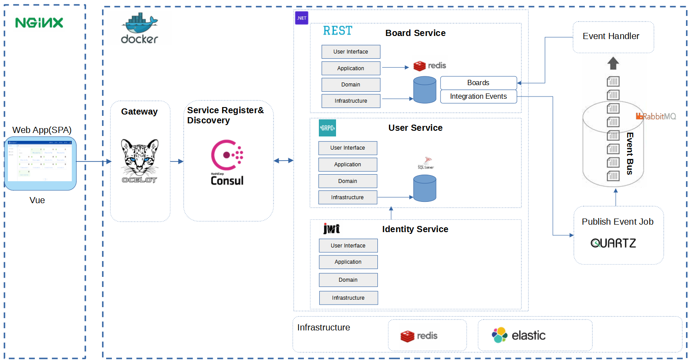

# Cube-System based on Microservices Architecture

## A Mordern Retrosepective System

1. The Frond-end web application is an Vue SPA program.
2. APIGateway is relay on Ocelet.
3. Microservices: User, Board and Identity which based on DDD
4. DataStore is using Azure SQL

## System Architecture



# Web
## Go to Web root directory
```
cd src/Web
```

## Project setup
```
npm install
```

### Compiles and hot-reloads for development
```
npm run serve
```

### Compiles and minifies for production
```
npm run build
```

# Microservices
## Compiles and run in containers
```
docker-compose build
```
```
docker-compose up
```
## Stop and cleanup running containers
```
docker-compose down
```

